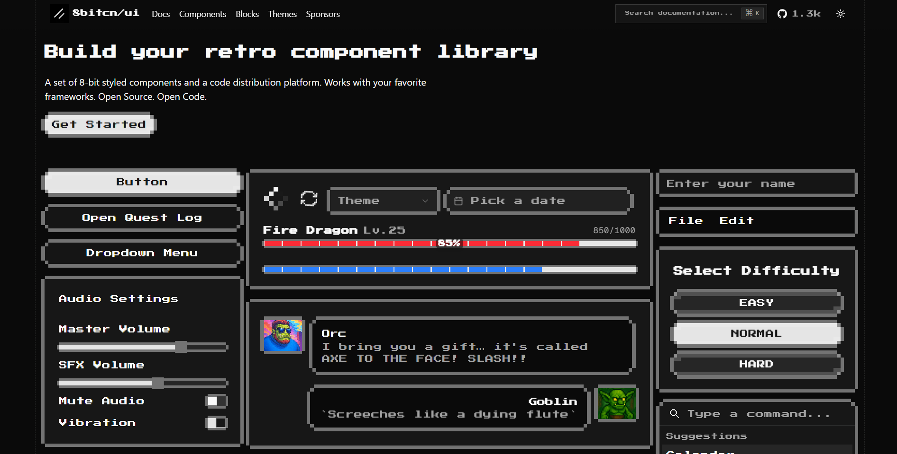
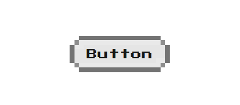

<div align="center">

<a href="https://8bitcn.com">
  
</a>

<p><strong>Free. Open Source. Built on shadcn/ui.</strong></p>

<p>
  <a href="https://github.com/TheOrcDev/8bitcn-ui/stargazers"></a>
  <a href="https://github.com/TheOrcDev/8bitcn-ui/forks"></a>
  <a href="https://discord.com/invite/uFB5YzH9YG"></a>
  <a href="/license.md"></a>
  <a href="https://ui.shadcn.com"></a>
  <a href="https://github.com/sponsors/theorcdev"></a>
</p>

<p>
  <a href="https://8bitcn.com/docs"><strong>Documentation</strong></a> ·
  <a href="https://8bitcn.com/docs/components"><strong>Components</strong></a> ·
  <a href="https://8bitcn.com/docs/blocks"><strong>Blocks</strong></a> ·
  <a href="https://8bitcn.com/themes"><strong>Themes</strong></a> ·
  <a href="https://discord.com/invite/uFB5YzH9YG"><strong>Discord</strong></a>
</p>

</div>



## Contributing

Please read the [contributing guide](/contributing.md).

### Usage Example

To add the `button` component to your project, run the following command:

```bash
pnpm dlx shadcn@latest add @8bitcn/button
```

Once installed, you can import and use the component in your files:

```typescript
import { Button } from "@/components/ui/8bit";

export default function App() {
  return <Button>Click me</Button>;
}
```

**Note:** The import path `@/components/ui/8bit` assumes your project has a path alias configured (common in Next.js and similar frameworks). Adjust the path to match your project's structure if needed.

<p align="center">
  
</p>

## License

Licensed under the [MIT license](/license.md).

## Open Source Program

<a href="https://vercel.com/oss">
  
</a>

## Star History

[](https://repostars.dev/?repos=TheOrcDev%2F8bitcn-ui&theme=terminal)
