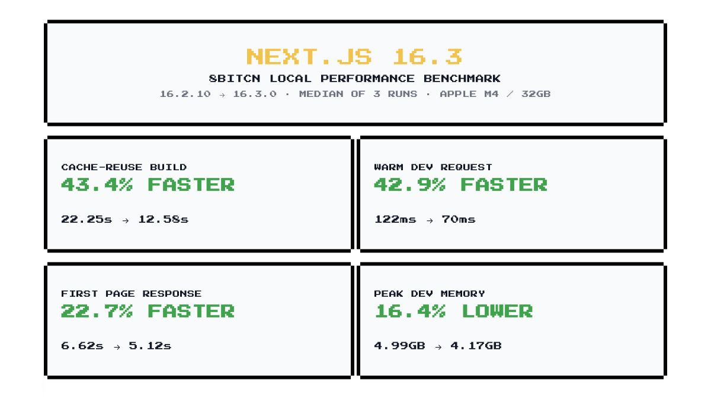

# Next.js 16.3.0 local performance benchmark

This compares the 8bitcn repository on Next.js 16.2.10 and 16.3.0. All values are medians of three runs on the same machine, and lower values are better.

## Results

| Metric | 16.2.10 | 16.3.0 | Change |
| --- | ---: | ---: | ---: |
| Cache-reuse production build | 22.25 s | 12.58 s | 43.4% faster |
| Cache-reuse build peak RSS | 5.25 GB | 3.71 GB | 29.3% lower |
| Development first page response | 6.62 s | 5.12 s | 22.7% faster |
| Warm development request | 122.4 ms | 69.9 ms | 42.9% faster |
| Warm development request p95 | 225.8 ms | 107.0 ms | 52.6% faster |
| Development peak RSS | 4.99 GB | 4.17 GB | 16.4% lower |
| Cold production build | 22.97 s | 27.22 s | 18.5% slower |
| Cold production build peak RSS | 5.29 GB | 5.79 GB | 9.5% higher |
| Cold docs route compile | 10.17 s | 10.74 s | 5.6% slower |
| Settled development RSS | 3.79 GB | 3.84 GB | 1.1% higher |

## Method

- Machine: 10-core Apple M4 MacBook Pro with 32 GB RAM, macOS 26.5.1.
- Runtime: Node.js 24.6.0 and pnpm 9.15.4.
- Telemetry was disabled for every measured process.
- Production: three independent pairs. Each pair removed `.next`, ran a cold `next build`, then immediately ran the same build again to measure cache reuse.
- Development: three runs with `.next` removed. Each run started `next dev`, requested `/`, `/blocks/not-found-brick-breaker`, `/blocks/not-found-crate-pusher`, and `/docs`, then requested all four routes five more times.
- RSS includes the complete spawned process tree, sampled every 50 ms. The report converts MiB to a base-2 GB-equivalent for compact display.
- No application code changed between the two benchmark sets; only Next.js and its resolved lockfile dependencies changed.

## Raw samples

### Production builds

| Version | Cold time (s) | Rebuild time (s) | Cold peak RSS (GB) | Rebuild peak RSS (GB) |
| --- | --- | --- | --- | --- |
| 16.2.10 | 22.97, 25.25, 22.17 | 22.25, 23.83, 22.06 | 4.99, 5.42, 5.29 | 5.25, 5.07, 5.54 |
| 16.3.0 | 27.22, 26.34, 31.82 | 12.76, 11.03, 12.58 | 6.17, 5.79, 4.51 | 3.34, 4.23, 3.71 |

### Development server

| Version | First page (s) | Warm median (ms) | Warm p95 (ms) | Settled RSS (GB) | Peak RSS (GB) |
| --- | --- | --- | --- | --- | --- |
| 16.2.10 | 6.62, 7.38, 6.31 | 122.4, 141.5, 121.6 | 225.8, 241.5, 207.8 | 4.59, 2.86, 3.79 | 4.99, 5.28, 4.96 |
| 16.3.0 | 5.67, 4.44, 5.12 | 69.9, 71.0, 65.6 | 107.0, 138.8, 102.6 | 4.16, 3.82, 3.84 | 4.48, 4.16, 4.17 |

These are local measurements for this repository, not general performance claims for all Next.js applications.
